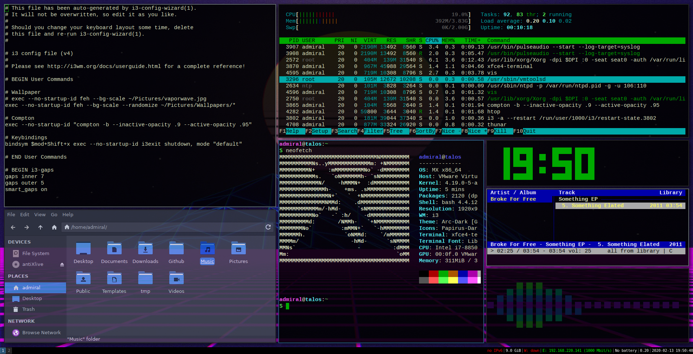

<!-- Shields -->
[![Contributors][contributors-shield]][contributors-url]
[![Forks][forks-shield]][forks-url]
[![Issues][issues-shield]][issues-url]

# Custom Dotfiles

This repository provides source control for commonly updated configuration files in my personal programming setup.

### Example Screenshot

### Graphical Environment
* **OS:** MX 
* **WM:** i3
* **Composite Manager:** Compton

### Themes
* **Window:** Arc-dark
8 **Mouse:** Breeze

# Installation

**NOTE:** Currently only Debian-based operating systems are supported.

Clone the repository, move into the new directory and run the installer script:

> sudo bash installer.sh

*More information to come!*

<!-- Links / Images -->
[contributors-shield]: https//img.shields.io/githube/contributors/brianjohnpolasek/Dotfiles.svg?style=flat-square
[contributors-url]: https://github.com/brianjohnpolasek/Dotfiles/graphs/contributors
[forks-shield]: https//img.shields.io/github/forks/brianjohnpolasek/Dotfiles.svg?style=flat-square
[fork-url]: https://github.com/brianjohnpolasek/Dotfiles/graphs/forks
[issues-shield]: https//img.shields.io/github/issues/brianjohnpolasek/Dotfiles.svg?style=flat-square
[issues-url]: https://github.com/brianjohnpolasek/Dotfiles/graphs/issues
